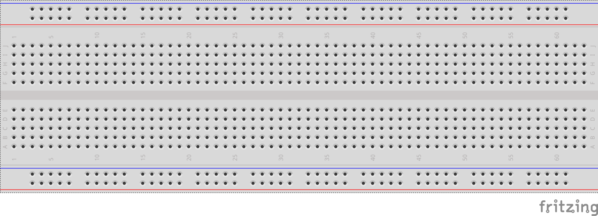
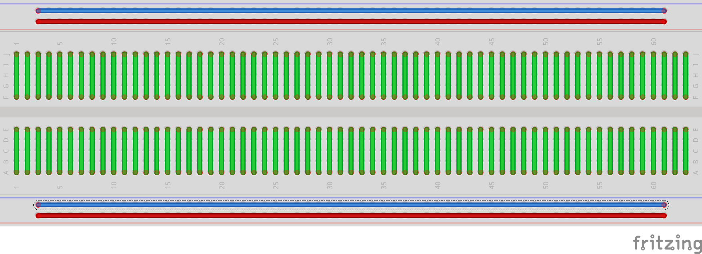
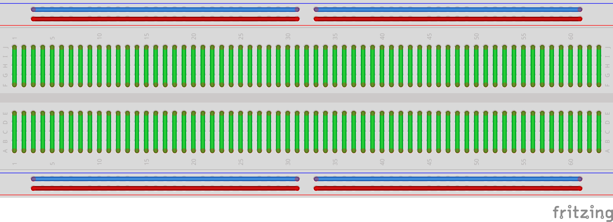

# getting starting with intro to circuits
hey look, things! now what?

## let's start with your breadboard

### breadboard
This is a breadboard. Notice all those holes? You can shove the legs of components in those holes to connect them together without any solder at all. Breadboards are pretty great, and they're a staple of electronics prototyping.

### breadboard connections
"How does shoving components into a breadboard connect them together?" you may (and should) ask. Well, all those holes are connected to each other internally in certain ways. Specifically, in these ways shown below.

An important thing to note: I've drawn red and blue lines running the whole way down the board on the sides. These are called the **power rails**. Normally, they are where you connect your voltage source and your voltage ground. **On some breadboards, the power rails disconnect in the middle of the board**. You should check to see if yours is connected or disconnected at the middle. Keep reading to find out how to check.

## wire strippers
Wire strippers are a tool we will use to strip the plastic sheath off of copper hook-up wire. Why? So we can plug these wires (specifically, about 22 guage wire) into our breadboard to make connections. You can buy jumper cables for this, but cutting your own wires at the right lengths to keep your breadboard circuits clean is way more reliable and way way easier to troubleshoot.

Plus it builds character.

### getting a length of wire
here we have a spool of wire. Say hello to the spool of wire. Let's cut a piece that's about an inch off.

Now, insert the wire into the hole labeled "22" or a close number, close the strippers, and pull the wire and strippers away from each other to strip off about a quarter inch of plastic. Also do it on the other end of the wire.

Finally, use the pliers built into the stripper to bend the ends of the wire, so you end up with a wire that can be easiely plugged into a breadboard.

Look how neat and tidy that is. You'll thank me later. Maybe. Or you'll throw a bunch of tiny wires at me.

## your multimeter
Your multimeter will be your most valuable tool. It is called a multimeter because it is a meter of multiple things. We'll be using it for four measurements:

* continuity
* resistance
* voltage
* current

We'll learn about them as class goes on. For now, we will set up the meter and learn how to test continuity.

### setting up your multimeter
First thing's first. Plug your probes into your multimeter if necessary. The black probe goes in the port labeled "COM" or "GND" or something similar. The red one goes in the port labeled "mA/Ω/V" or something similar. It'll look something like this:

Second thing's second. Take a two pieces of 22 gauge wire (I recommend black and red) about three inches long, strip one end of each about a quarter inch, and the other end about one inch. You'll have two pieces of wire that look similar to this:

Then, wrap the bare, inch long side of the wire around a pointy part of your multimeter (called the **probe**). This pointy thing is what you touch to electric-like part to test them. By attaching wires to them, we make it way easier to plug our multimeter directly into our breadboard like this:

### measuring continuity
Continuity is an easy concept. If two parts of a circuit are continuous, there is a connection between them without anything in the may. If there is a bare electrical connection between two points, they are continuous. Switch your multimeter to continuity mode. It'll look something like this on the dial:

Take your two fancy, breadboard friendly multimeter probes, and stick them into two holes that I told you earlier are connected. You'll hear a beep, or see something on the screen if your multimeter doesn't have a beeper. Now try it again between two holes that aren't connected. The screen will likely read 1 or other number, and there will be no beep.

Now would be a good time to check the power rails of your breadboard. Connect the multimeter between the two halves of each power rail and see if it beeps. If it doesn't beep, you will probably want to add jumper wires to get continuous rails.

## your power source
In this class, we'll use an Arduino microcontroller board as a power supply. We'll also end up using it as a primitive oscilloscope. For now, let's get it set up on a breadboard.
