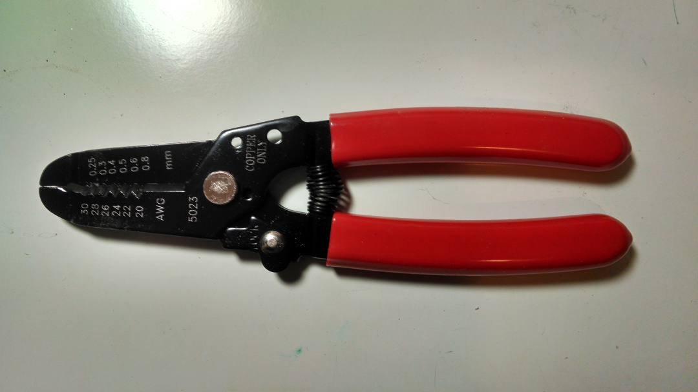
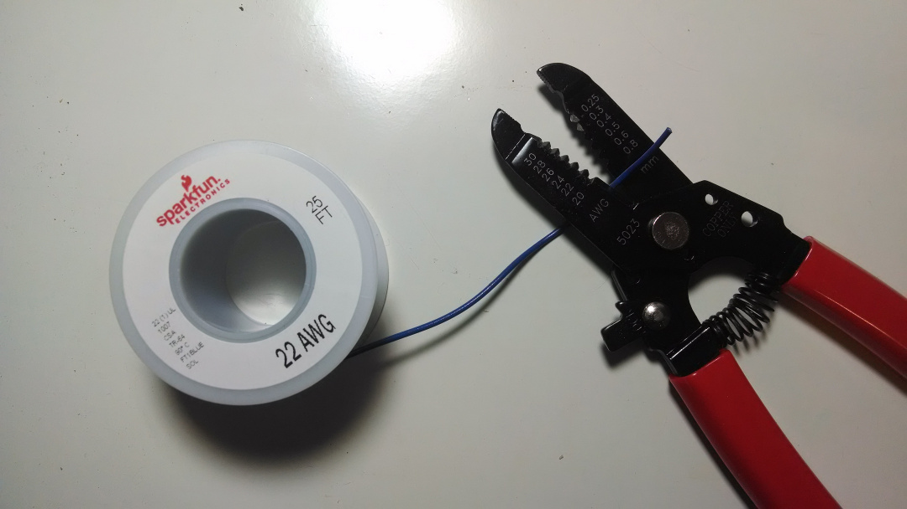
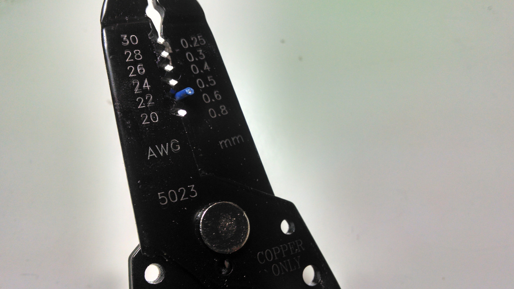
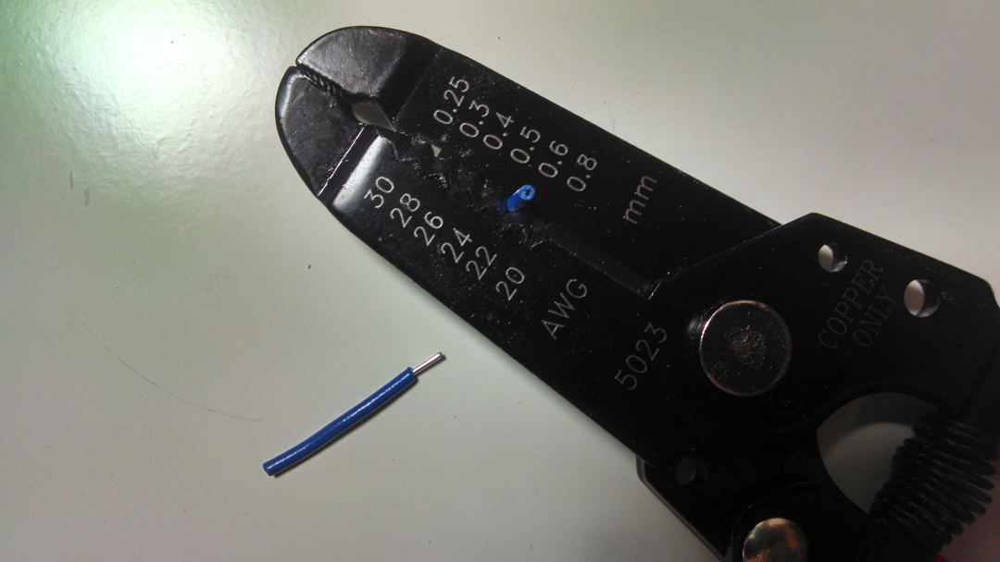
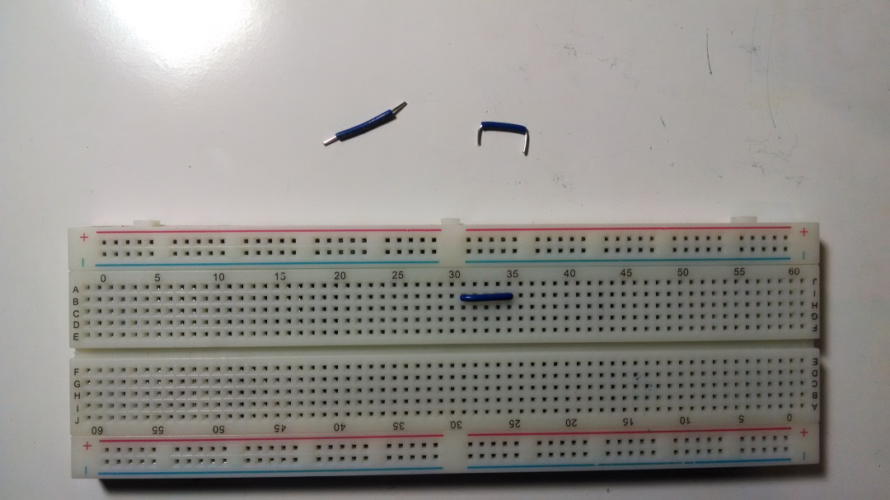

# getting starting with intro to circuits
hey look, things! now what?

## let's start with your breadboard

### breadboard
This is a breadboard. Notice all those holes? You can shove the legs of components in those holes to connect them together without any solder at all. Breadboards are pretty great, and they're a staple of electronics prototyping.

### breadboard connections
"How does shoving components into a breadboard connect them together?" you may (and should) ask. Well, all those holes are connected to each other internally in certain ways. Specifically, in these ways shown below.

An important thing to note: I've drawn red and blue lines running the whole way down the board on the sides. These are called the **power rails**. Normally, they are where you connect your voltage source and your voltage ground. **On some breadboards, the power rails disconnect in the middle of the board**. You should check to see if yours is connected or disconnected at the middle. Keep reading to find out how to check.

## wire strippers
Wire strippers are a tool we will use to strip the plastic sheath off of copper hook-up wire. Why? So we can plug these wires (specifically, about 22 guage wire) into our breadboard to make connections. You can buy jumper cables for this, but cutting your own wires at the right lengths to keep your breadboard circuits clean is way more reliable and way way easier to troubleshoot.

Plus it builds character.

### getting a length of wire
here we have a spool of wire. Say hello to the spool of wire. Let's cut off a piece that's about an inch long.

Now, insert the wire into the hole labeled "22" or a close number, close the strippers, and pull the wire and strippers away from each other to strip off about a quarter inch of plastic. Also do it on the other end of the wire.

Finally, use the pliers built into the stripper to bend the ends of the wire, so you end up with a wire that can be easily plugged into a breadboard.

Look how neat and tidy that is. You'll thank me later. Maybe. Or you'll throw a bunch of tiny wires at me.

## components
You were given a lot of components. You don't need to know what they all do quite yet, but you should endeavor to keep them at least somewhat organized. A little sectioned box will make your life a lot happier.

Also, a lot of your components have very longs legs. These long legs will get in your way while building circuits, so I will usually make you cut them down before putting them in the breadboard. You can use you wire strippers for this. Here is the difference between a cut and uncut part in the breadboard:

## your power source
In this class, we'll use an Arduino microcontroller board as a power supply. We'll also end up using it as a primitive oscilloscope. For now, let's get it set up on a breadboard.

The Arduino board takes power over USB from your computer. This gives us a nice source of electricity to work with. Connect a wire from the pin of the Arduino labeled either "VCC" or "5V", and connect it to a red power rail on your breadboard. This will be our positive voltage source. If you have an Arduino that can be inserted right into a breadboard, do that, and then run the connection from a breadboard hole in that row to the power rail. It will look something like this:

Now, look for a pin labeled "GND". You might have several; any will work. Connect a "GND" pin to the blue power rail. This will be our negative power source, or as we'll call it, our ground. We've effectively connected two ends of a 5V battery to our two voltage rails. Now, whenever we need to plug something into power or ground, we can do it at any point along the breadboard.

Since it's voltage differences between points that matter, much like defining sea-level as zero altitude, we will define the voltage level at ground to be our zero. We will actually learn about this in Lesson 1.

Now would be a good time to plug your Arduino into your computer and confirm that its power light comes on. If not, make sure that everything is plugged in correctly. If it does look like it and it still doesn't work, ask your teacher.

## your multimeter
Your multimeter will be your most valuable tool. It is called a multimeter because it is a meter of multiple things. We'll be using it for four measurements:

* continuity
* resistance
* voltage
* current

We'll learn about them as class goes on. For now, we will set up the meter and learn how to test continuity. We'll also show how to measure resistance, voltage, and current, but those sections are better off skipped until after lesson 1, and are here so you can come back and review.

### setting up your multimeter
First thing's first. Plug your probes into your multimeter if necessary. The black probe goes in the port labeled "COM" or "GND" or something similar. The red one goes in the port labeled "mA/Ω/V" or something similar. It'll look something like this:

Second thing's second. Take a two pieces of 22 gauge wire (I recommend black and red) about three inches long, strip one end of each about a quarter inch, and the other end about one inch. You'll have two pieces of wire that look similar to this:

Then, wrap the bare, inch long side of the wire around a pointy part of your multimeter (called the **probe**). This pointy thing is what you touch to electric-like part to test them. By attaching wires to them, we make it way easier to plug our multimeter directly into our breadboard like this:

### measuring continuity
Continuity is an easy concept. If two parts of a circuit are continuous, there is a connection between them without anything in the may. If there is a bare electrical connection between two points, they are continuous. Switch your multimeter to continuity mode. It'll look something like this on the dial:

Take your two fancy, breadboard friendly multimeter probes, and stick them into two holes that I told you earlier are connected. You'll hear a beep, or see something on the screen if your multimeter doesn't have a beeper. Now try it again between two holes that aren't connected. The screen will likely read 1 or other number, and there will be no beep.

Now would be a good time to check the power rails of your breadboard. Connect the multimeter between the two halves of each power rail and see if it beeps. If it doesn't beep, you will probably want to add jumper wires to get continuous rails.

Generally, after you build a circuit, you should check to make sure your two power rails are not continuous with each other before plugging power in. Also, if for some reason your Arduino wasn't turning on earlier, you should unplug your Arduino, and then use your continuity meter to make sure there isn't a short (a direct connection between to normally unconnected parts of a circuit) between and of the power pins (VCC, Vin, 5V, 3.3V, etc.) and GND. If there is, your computer will shut down power to the USB port and the Arduino will not work.

### measuring voltage (learned in lesson 1)

### measuring current (learned in lesson 1)

### measuring resistance (learned in lesson 1)

## all is well
You should be good to go, so go ahead and get started with [lesson1](../lesson1)