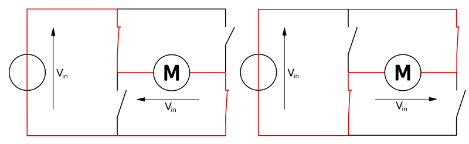
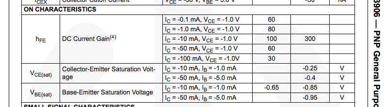
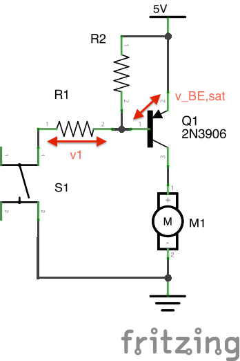

# intro to circuits - the h-bridge
The circuit that looks like an 'h'

## why use an h-bridge?
If we have a motor, we often want to be able to make that motor go either forwards or backwards. A motor will turn one way if current is flowing through it in one direction, and it will turn the other way if current is flowing in the other direction.

**An h-bridge allows us to send current in either direction through a motor to change its rotational direction.**

## what does an h-bridge look like?
An h-bridge is a series of four switches arranged around a motor like so:

Source: Cyril Buttay, CC-BY-SA 2.5,  http://en.wikipedia.org/wiki/File:H_bridge.svg

By alternation which switches are open and which are closed, the motor will turn clockwise or counterclockwise.

Source: Cyril Buttay, CC-BY-SA 2.5,  http://en.wikipedia.org/wiki/File:H_bridge_operating.svg

We can build what's called a "truth table" to examine the different possible states of an h-bridge. In this truth table, a '1' represents a closed switch, a '0' represents and open switch, and an 'X' represents "doesn't matter".

S1 | S2 | S3 | S4 | Result
-- | -- | -- | -- | ------------
0  | 0  | 0  | 0  | Motor coasts
1  | 1  | X  | X  | Shoot through (**bad**)
X  | X  | 1  | 1  | Shoot through (**bad**)
1  | 0  | 1  | 0  | Motor brakes (fine)
0  | 1  | 0  | 1  | Motor brakes (fine)
1  | 0  | 0  | 1  | Clockwise
0  | 1  | 1  | 0  | Counterclockwise

First, let me draw your attention to the shoot through conditions. A shoot through means that the current is going to shoot straight from Vin to ground, missing the motor entirely, and probably damaging your circuit. Shoot through should be avoided.

Coasting and braking are what they sound like. If the motor is moving, and then all switches are opened, the motor will coast until friction stops it. Conversely, if the motor is moving, and a braking condition is applied, the motor will stop turning. This is because both terminals of the motor are held at the same voltage level, so no current can flow through it.

Finally, and most interestingly, there are the last two conditions in the table. These are the ones that make the motor turn. Look at the table and the circuit diagrams above it and see if they make sense.

## building an h-bridge
While we could build an h-bridge with our push-buttons, we will not. Why? Ideally, [our motor](https://www.sparkfun.com/products/11696) wants 100mA. Our switches are only rated at 50mA. So, instead of using just pushbuttons, we will use transistors to switch the motor loads, and pushbuttons to control the transistors.

### step 1 - control a motor with a PNP transistor
To start, we will use a single PNP transistor (2N3906) as a high-side switch to control a motor. This way, we can figure out what value resistors we need to bias our transistors to saturation. Don't remember what transistor biasing is all about? Try reviewing the [transistor material](../transistors).

Our load (as I mentioned a second ago) is 100 mA. First, we go to our [transistor's data sheet][2N3906] and look up it's characteristics at a collector current of 100mA.

From this table, with I_C = 100mA (the datasheet says -100mA because in a PNP transitor, current flows out of the collector), we see that the minimum gain is going to be 30. So **we will use h_FE = 30** in our calculations.

We aslo can see that as IC gets higher, so does the saturation voltage drop from the emitter to the base. Looking at this table (and at the graph on the third page relating V_BE,sat to i_C), **we will use V_BE,sat = 1.0V** in our calculations.

Using a gain of 30 and a load current of 100mA, we need a base current of 100mA/30 = 3.3mA. To ensure saturation, we will bump that up to **i_B = 5mA**.

Ignoring the existence of R2 for a moment, our base current is going to be equal to the current going through R1. To find the proper value of R1, we need to find the value of v1. v1 = 5V - v_BE,sat, so **v1 = 4.0V**. If we want i_1 to equal 5mA, and v_1 = 4.0V, using Ohm's law we find that **R1 needs to be less than or equal to 800Ω**. The closest resistor we have that is less than 800Ω is 330Ω, so let's use **R1 = 330Ω**.

### step 2 - add an NPN transistor at the low side

### step 3 - re

[2N3906]: https://www.fairchildsemi.com/ds/2N/2N3906.pdf "2N3906 datasheet"
