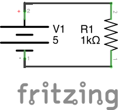
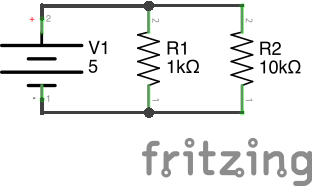
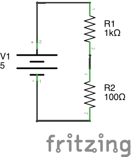

# intro to circuits lesson 1
what is all this electricity business about?

## lesson materials
the presentation used for this class is available in [PDF form](lesson1.pdf) as well as [Google Drive form](https://docs.google.com/presentation/d/15GSJ7vIjcBHzid15Rd07gUInJye-16uV2sa6j8g2wJ4/edit?usp=sharing)

Circuits referenced in that presentation are available in this directory. Each circuit has three files:

* `circuit_1-N_schem.png` - the circuit schematic
    * you should try to build your breadboard circuit from this schematic
* `circuit_1-N_bb.png` - an example breadboard layout for the circuit
    * use this is you are having trouble translating schematic to breadboard
    * there is no one right answer; your solution could and probably will look completely different that this
* `circuit_1-N.fzz` - [fritzing](http://fritzing.org/) file for the circuit
    * this is what the schematic and breadboard files are generated from
    * you can play around with circuit changes here in both schematic and breadboard mode

## circuit list
where the electrons live

### circuit 1-1

A resistor hooked to a power supply. The voltage difference applied across the resistor causes a current to flow through the resistor. This current is determined by Ohm's law:

Where i = current in amperes (A), v = voltage in volts (V), and R = resistance in ohms (Ω)

### circuit 1-2

Two resistors in parallel. This circuit allows us to use both Kirchhoff's Current Law (the current flowing into any node in a circuit must be equal to the current flowing out of the node):

And Kirchhoff's Voltage Law (the voltage differences across components in a closed loop in a circuit must sum to zero):

By applying these two laws, we know that the voltage across both resistors is equal to the voltage difference across the power supply, and that the current flowing out of the power supply is split between the two resistors. We can find the proportion with which is splits by applying Ohm's Law to each resistor (see above) and letting the algebra work itself out.

After running through the math, you can check your results using your multimeter, remembering to put your multimeter in series with the current being measured and in parallel to the voltage being measured.

### circuit 1-3

Two resistors in series. If we apply Kirchhoff's Laws to this circuit, we notice that there are no nodes, so the current going through each component must be equal, and there is only one loop, so the voltages across the resisters must sum to the voltage across the battery.

Using these relationships and Ohm's Law, you can find out how much current this circuit draws from the power supply. Check the math with your multimeter.
