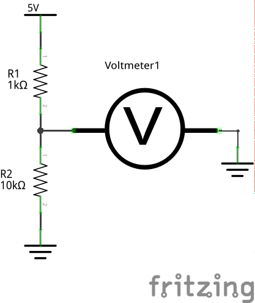
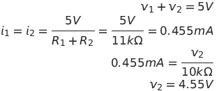
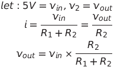
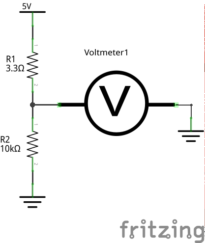
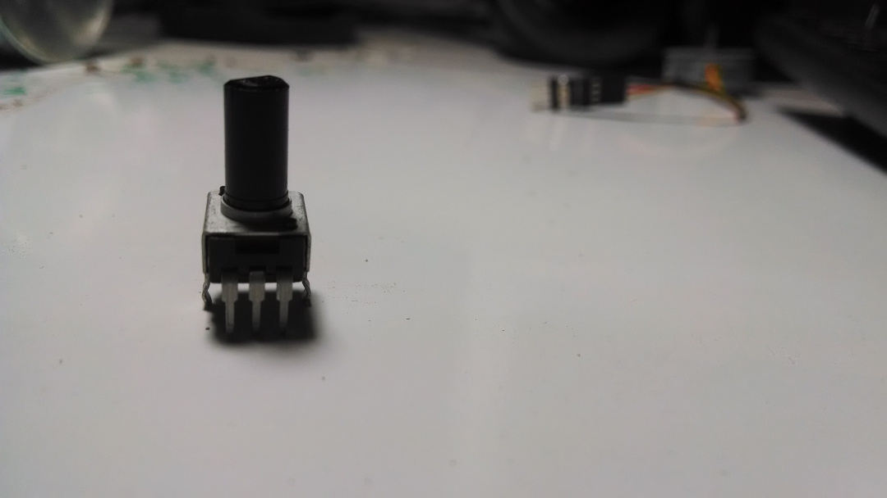
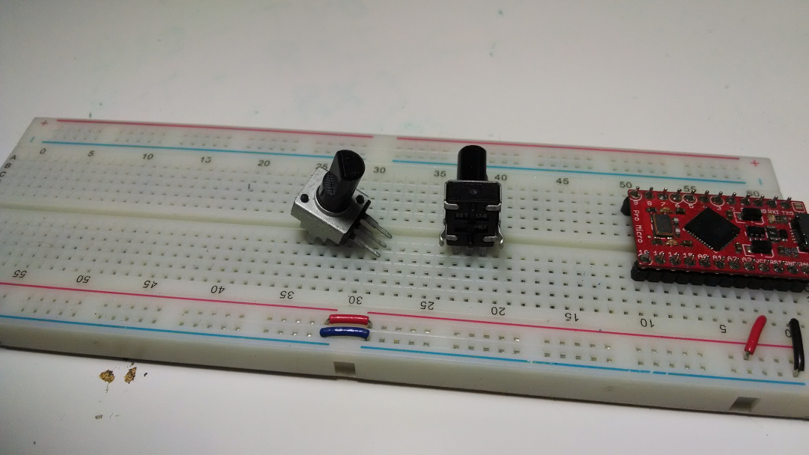
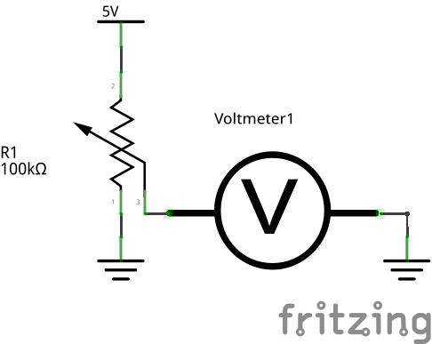
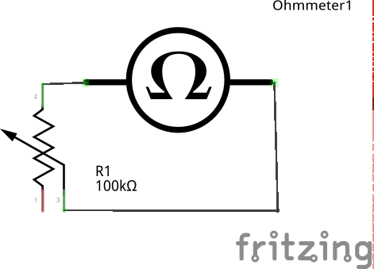
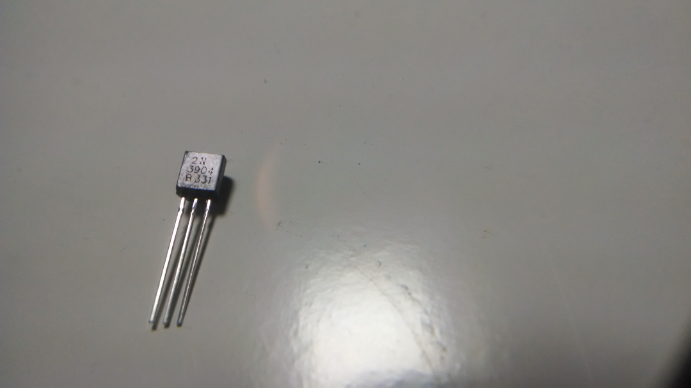

# intro to circuits lesson 3
all about transistors (and some other stuff)

## potentiometers (the other stuff)

### voltage dividers
Consider the following circuit:

It's pretty simple: two resistors in series, and we're measuring the voltage level between them (or, in other words, the voltage across the bottom resistor). What will that voltage be?

Hey, look, that voltage looks to be around 9/10 of the starting voltage (in actuallity, it's 10/11 of 5V). Let's take our math from above and generalize it a little:

In a voltage divider, the voltage level in between the two resistors is equal to the input voltage times the ratio of the second resistor to the sum of both resistors.

Verify this by building this circuit with one resistor changed and running that calculation.

You should see a voltage of around 3.8V on your voltmeter.

How does this help us? In the course of... this course, we will ocasionally need a reference voltage of some sort. Since the only source we have is 5V, we need a way to get all the voltages in between.

### what is a potentiometer and how does it fit into all of this
So, without further ado, let's get to potentiometers. This is the symbol for a "pot" (as they will be called from now on):

")

"Hey, that looks a lot like a resistor," you're thinking right now. If not, please take a moment to think that. That's because there's a resistor in there. Potentiometers come in different values, and that value is the resistance of the resistor inside it.

Also notice that little arrow. A pot is a three pin device. Two of the pins are the ends of the resistor, and the third pin is that arrow. Take a moment to find one of your pots. It'll look a lot like this:

You have two pots: a 10k pot and a 100k pot. The 10k is green, the 100k is black.

See those three pins? The outer pins are the resistor, and the middle pin is the arrow, called the wiper. What does the wiper do? As you turn the knob of the pot (that black thing is a turny knob) the wiper moves back and forth along the resistor, splitting it into two resistors. It's a [variable voltage divider](http://en.wikipedia.org/wiki/Potentiometer).

You'll also notice a pair of big, rectangular legs on the sids of the pot. Ignore them; they're purely structural. Bend the three leads in front out and plug it into your breadboard:

### potentiometer as a voltage divider
Now that you've got a pot in your breadboard, wire up this next circuit. You may use either your 10k or 100k pot.

If you turn the knob, you'll notice the voltage level range from nearly 0 to nearly 5. Congratulations, you've just built a variable voltage divider. You'll get the same result with both the 10k and the 100k pot. Can you think why that is? Look up at the earlier equations and ponder this fact.

### potentiometer as a variable resistor
If you only hook up one end of the resistor and the wiper to your circuit, you've created what is called a rheostat, or vairable resistor. Use your **ohmmeter** to test this.

As you turn the pot, you will notice your ohmmeter measuring from about 0 to 100k for the 100k pot, or 10k for the 10k pot. This configuration is useful when you're building a circuit and need a resistor, but you're not sure what value that resistor should be. In that case, you can hook in a pot as a rheostat and find the optimal value for the circuit. We will do this later in the lesson.

## transistors (the fun stuff)
### what is a transistor?
Transistors are the backbone of our digital world. There are millions of them in the computer you're on right now. I've given you twenty. They look a lot like this:

A transistor is like a valve controlling water flow, except it controls current flow. It can be closed, partially open, or fully open.

### types of transistors
The transistors that you have are called bi-polar junction transistors, or BJTs. They are so-called because they rely on a sandwich of two types of semiconductors. If you care about any of this, I highly recommend [the wikipedia page](http://en.wikipedia.org/wiki/Bipolar_junction_transistor).

The semiconductors are referred to as N-type and P-type. Because the BJT is a sandwich of these two materials, there are two possible configurations: NPN and PNP.

#### NPN BJTs
You have five NPN transistors with the model number 2N3904. You can see this written in very small letters on the flat face of the transistor.

The symbol for an NPN transistor is this:
