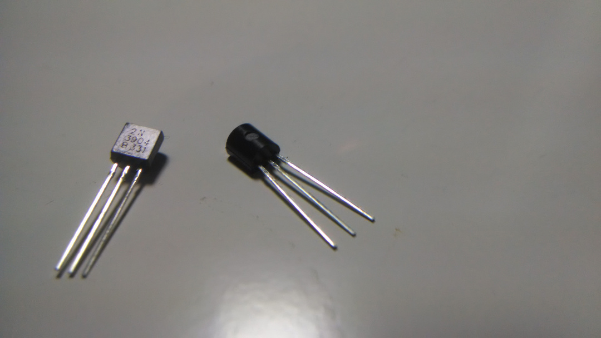
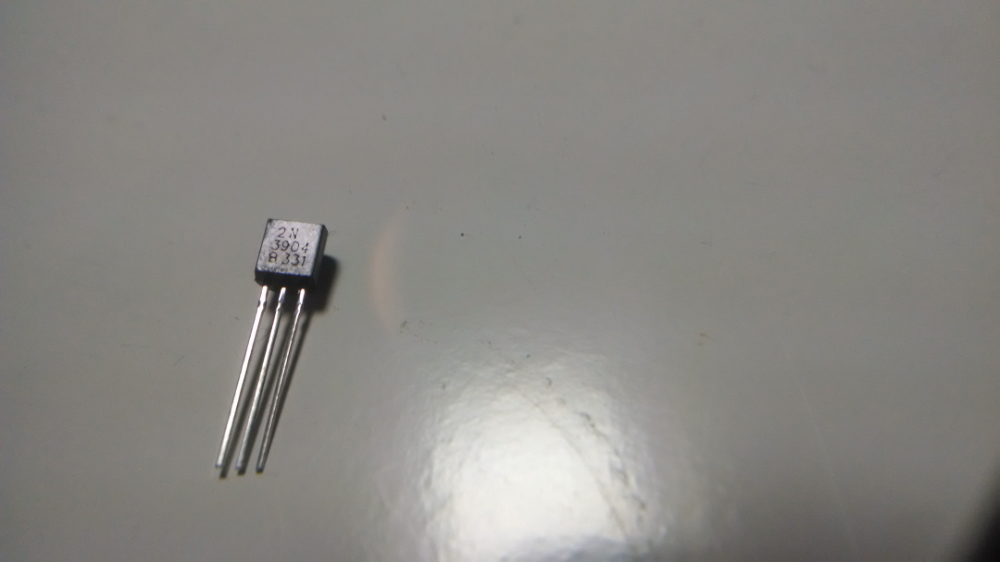
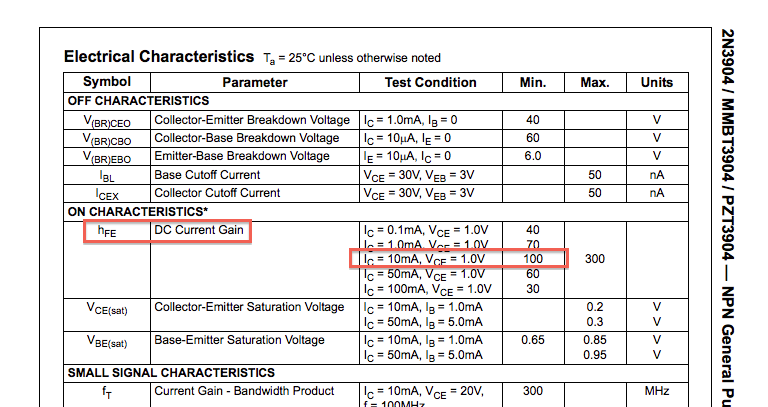

# intro to circuits - transistors (the fun stuff)
Transitioning into puns that are even worse than before.

## what is a transistor?
Transistors are the backbone of our digital world. There are millions of them in the computer you're on right now. I've given you twenty. They look a lot like this:

A transistor is like a valve controlling water flow, except it controls current flow. It can be closed, partially open, or fully open.

## types of transistors
The transistors that you have are called bi-polar junction transistors, or BJTs. They are so-called because they rely on a sandwich of two types of semiconductors. If you care about any of this, I highly recommend [the wikipedia page](http://en.wikipedia.org/wiki/Bipolar_junction_transistor).

The semiconductors are referred to as N-type and P-type. Because the BJT is a sandwich of these two materials, there are two possible configurations: NPN and PNP. We will start off with NPN BJTs.

Another important type of transistor is the FET (field-effect transistor). We will not use them in this course, but please know that they do exist, and operate differently than BJTs.

## NPN BJTs
You have five NPN transistors with the model number **2N3904**. You can see this written in very small letters on the flat face of the transistor. Every transistor with the same model number has the same specifications, and you can use the model number to find those specs.

The symbol for an NPN transistor is this:

The E, B, and C stand for Emitter, Base, and Collector, respectively. Where do those names come from? Who cares? I forget. Probably something about holes and electrons. [You might be able to find out here](http://en.wikipedia.org/wiki/Bipolar_junction_transistor). Regardless of all that, **take note of the arrow on the emitter pin and the direction (outwards) that it's pointing.**

Do you remember that time I told you that transistors are like valves? It's still true. The current that an NPN transistor valve controls is the **current flowing between the collector and the emitter.**

What determines how "open" the "valve" is? The current flowing into the base. More specifically:

Where i_CE is the current flowing from the collector to emitter, i_BE is the current flowing into the base (and out the emitter), and h_FE is the gain of the transistor. The gain is a property of the transistor and is usually around 100.

**A little bit of current flowing into the base allows a lot of current to flow into the collector**. Both of those currents flow out of the emitter.

## datasheets

Where do we find the gain (and other properties of the transistor)? From the **datasheet**. Datasheets are big sheets of data about specific parts. You find them by googling the part number and then clicking the first PDF link you see. Try it now with your NPN BJT part number (2N3904).

You'll hopefully find [something like this](http://www.fairchildsemi.com/ds/2N/2N3904.pdf).

This document looks pretty daunting! Don't worry, I have a trick. **If you see something you don't understand, ignore it.** Eventually, you'll need more bits of information, and you'll learn about them specifically then. The way to get good at reading datasheets is to read a lot of datasheets. And the way to read a lot of datasheets is to not get overwhelmed by all the data.

**Skim through your datasheet and see if you can find the gain for your transistor.** You'll find several numbers in a table, all corresponding to different "test conditions". You can use these test conditions to decide what the gain is likely to be for a circuit you design.

Source: http://www.fairchildsemi.com/ds/2N/2N3904.pdf

For simplicity's sake, at the moment we're gonna assume the gain is always 100. This assumption turns out to work a lot of the time, for a lot of transistors, but it isn't always true.
